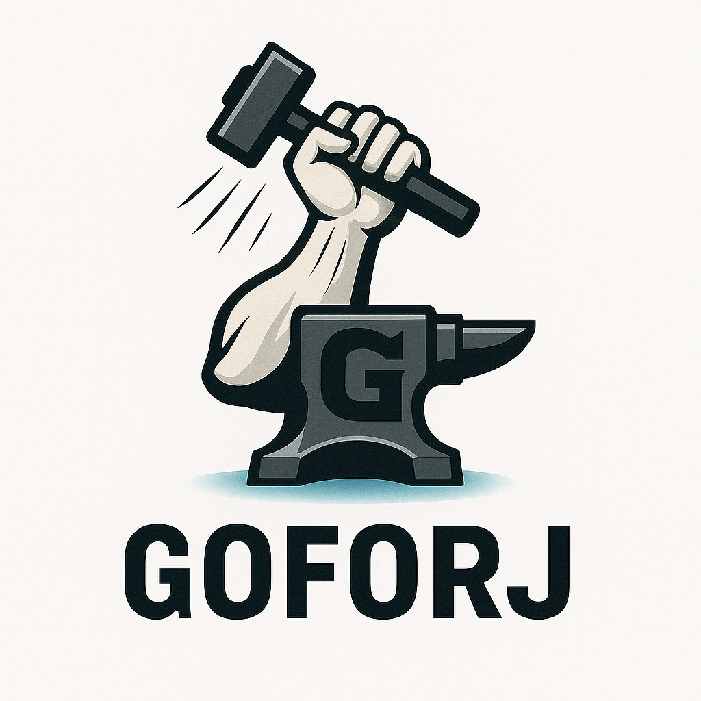

<p align="center">
  
</p>

<h1 align="center">GoForj</h1>

<p align="center">
<strong>This project is currently unreleased and under heavy active private development.</strong>
</p>
<br />

## ✨ What is GoForj?

GoForj is a **developer experience-first** CLI and framework core for Go applications.

It gives you **the power of a framework**, without forcing an entire architecture on you.

- 🚀 **Rapid CLI scaffolding** (commands, controllers, migrations, etc.)
- 🛠️ **Project structure bootstrapping**
- 🔌 **Modular plugin system** (opt-in migrations, generators, more)
- 🧩 **Wire/DI** first — true decoupled architecture
- ⚡ **Zero lock-in** — bring your own patterns
- 🐹 **Designed for Go developers** who want more structure, without being handcuffed

## 📦 Installation

```bash
go install github.com/goforj/goforj@latest
```